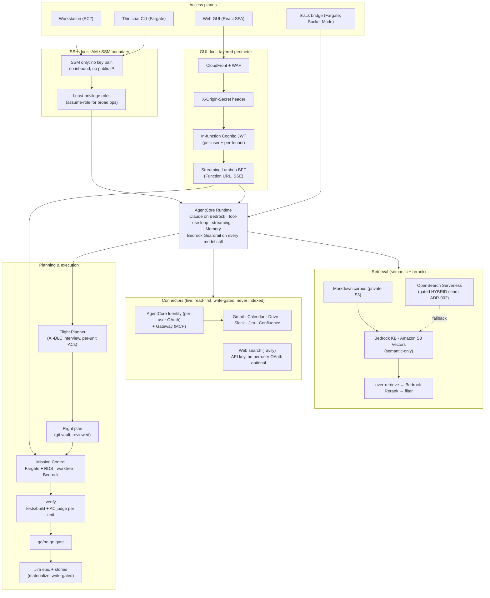

# Homebase

Homebase is a personal AI pipeline: an authenticated web GUI plus an SSH plane over a private
knowledge base, running on AWS and Anthropic-native. It is the single-tenant seed of a future
multi-tenant platform.

This repository is PUBLIC. Every committed file is world-readable. No account IDs, ARNs, secrets,
real domains, or personal identifiers live in the repo. Every environment-specific value is an
input (a Terraform variable, a runtime environment variable, an AWS Secrets Manager secret, or an
SSM Parameter Store SecureString), never a literal in code. See [CLAUDE.md](./CLAUDE.md) for the
full conventions.

## Architecture

- Agent runtime on Amazon Bedrock AgentCore, running a tool-use loop over knowledge-base search, the
  live connectors, and optional live web search (Tavily), streaming its answer token by token, with a
  Bedrock Guardrail applied to every model (Converse) call so one governance layer protects all doors
  at the model boundary
- Retrieval via Bedrock Knowledge Base with S3 Vectors, using semantic retrieval plus Bedrock Rerank
  (S3 Vectors is semantic-only; hybrid is the gated OpenSearch Serverless seam, ADR-002)
- Authentication via Amazon Cognito with Google federation
- Web GUI as a React SPA served from CloudFront, rendering the streamed response live
- Streaming backend for frontend (BFF) as a Lambda Function URL with response streaming (SSE), fronted
  by CloudFront; not behind API Gateway
- A thin chat CLI running as a Fargate container
- A Slack bridge as an optional front door: a slack-bolt Socket Mode service on Fargate, VPC-internal
  in the shared vault-worker private subnet, with no inbound (Socket Mode is an outbound WebSocket) and
  NAT egress only; it resolves the Slack user's verified email, gates on an allow-list, invokes the same
  agent runtime with that identity (the ssh-chat task-role pattern), and answers back in a thread
- A separate EC2 workstation reached over SSM (no public SSH)
- Six live connectors (Gmail, Calendar, Drive, Slack, Jira, Confluence): read-first and write-gated,
  each with per-user OAuth via AgentCore Identity (an AgentCore Gateway also exposes them as MCP tools);
  the user links an account once through a self-service consent flow in the GUI. When a token later
  expires, the GUI shows a non-blocking banner and re-consent opens in a separate window, so on-screen
  work is not interrupted
- An optional web-search connector (Tavily) that gives the agent live internet access as two read
  tools (`web_search`, `web_fetch`). It follows the same shim/MCP pattern but is keyed by a single
  Secrets Manager API key rather than per-user OAuth; fetching is delegated to Tavily's server-side
  extract (the Lambda never dereferences a model-supplied URL, containing SSRF), and it is enabled only
  when the `tavily_secret_name` input is set
- Audit and hardening: a multi-region CloudTrail management-plane trail, VPC flow logs, Cognito
  refresh-token rotation with short-lived access tokens, an allow-list that is fail-closed by default,
  CloudFront security headers (HSTS, nosniff, frame-DENY) with an opt-in CSP, and a CI IaC security
  scan (Checkov, gated on new findings)
- A git-authoritative vault: a Fargate vault worker owns the clone and commits every write, so notes
  and flight plans are versioned and attributed from git; the S3 corpus is the derived KB mirror
- A Flight Planner where the agent runs an AI-DLC INCEPTION interview to produce reviewed flight plans,
  each unit carrying its own acceptance criteria, handed to Mission Control (a durable, cost-metered
  coding-agent orchestrator on Fargate + RDS, its own repo) for execution, with live per-step telemetry
  and a go/no-go gate surfaced in the GUI Mission deck; before the gate a verify node runs the target
  repo's own tests/build and judges each unit against its acceptance criteria, and can only add a block,
  never flip a no-go to a go
- Confluence design pages as grounded plan sources, and Jira materialization of a cleared plan (an epic
  plus a story per unit) through the write-gated connector: design in, tickets out
- All infrastructure defined as Terraform IaC

For the full picture (the two access planes, the retrieval flow, the layered security perimeter, the
connector strategy, and the planning-to-execution loop), open the self-contained
**[architecture.html](./architecture.html)** at the repository root (inline CSS and vanilla JS, no build
step, no network).



Retrieval on Amazon S3 Vectors is **semantic plus Bedrock Rerank, not hybrid**. Hybrid (dense plus
keyword) is not available on S3 Vectors; OpenSearch Serverless is the gated hybrid seam (ADR-002),
chosen on evidence from the eval harness, not by default.

## Monorepo layout

```text
infra/          Terraform IaC (modules/ and stacks/)
services/       Backend services
  agent/        AgentCore agent runtime
  bff/          Streaming Lambda BFF (Function URL, SSE)
  ingestion/    Knowledge base ingestion pipeline
  connectors/   Connectors (read-first shim Lambdas + catalog): six per-user OAuth + a no-OAuth web-search (Tavily) shim
  vault-worker/ Fargate service that owns the git vault clone (writes commit to git)
  slackbot/     Slack bridge (slack-bolt Socket Mode service on Fargate, allow-list gated)
web/            React SPA (Vault · Chat · Plan · Mission surfaces)
cli/            Thin chat CLI container
workstation/    EC2 workstation bootstrap
eval/           Evaluation harness: retrieval quality + multi-model generation benchmarks
docs/           Project documentation
```

Mission Control (the execution engine) is a separate repository, deployed into this account by the
`mission-control` Terraform stack and reached over the private VPC. The contract between them is
documented in `docs/mission-control-seam.md`.

## Setup prerequisites

- AWS credentials via SSO. Sign in with `aws login` (browser based, no long-lived access keys).
  Set your region with `export AWS_REGION=<YOUR_AWS_REGION>`.
- Terraform (see `infra/` for the pinned version once foundation lands).
- Node.js (for `web/` and `cli/`).
- Python (for `services/`, `eval/`, and tooling).

Copy `.env.example` to `.env` (git-ignored) and fill in local values. Copy
`infra/terraform.tfvars.example` to `infra/terraform.tfvars` (git-ignored) and fill in your inputs.

## Pre-commit hooks

This repository uses [pre-commit](https://pre-commit.com/) to run secret scanning (gitleaks),
`terraform fmt`, and whitespace hygiene before every commit. Install it once:

```bash
# Install the pre-commit tool (choose one)
pipx install pre-commit        # or: pip install pre-commit, or: brew install pre-commit

# Register the git hooks in this repo
pre-commit install

# Optional: run against the whole tree
pre-commit run --all-files
```

After `pre-commit install`, the hooks run automatically on each `git commit`.

## Security

See [SECURITY.md](./SECURITY.md) for how secrets are handled and how to report an issue.
Infrastructure is never auto-applied by an agent: agents may run `terraform fmt`, `validate`, and
`plan` only; a human runs `apply`.
