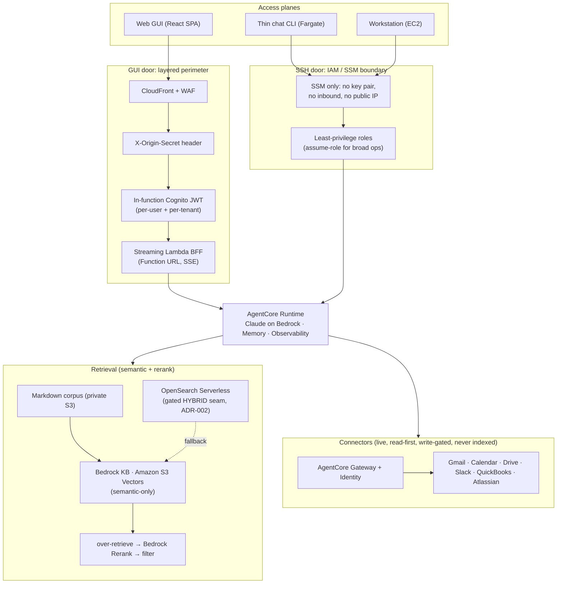

# Homebase

Homebase is a personal AI pipeline: an authenticated web GUI plus an SSH plane over a private
knowledge base, running on AWS and Anthropic-native. It is the single-tenant seed of a future
multi-tenant platform.

This repository is PUBLIC. Every committed file is world-readable. No account IDs, ARNs, secrets,
real domains, or personal identifiers live in the repo. Every environment-specific value is an
input (a Terraform variable, a runtime environment variable, an AWS Secrets Manager secret, or an
SSM Parameter Store SecureString), never a literal in code. See [CLAUDE.md](./CLAUDE.md) for the
full conventions.

## Architecture

- Agent runtime on Amazon Bedrock AgentCore
- Retrieval via Bedrock Knowledge Base with S3 Vectors, using semantic retrieval plus Bedrock Rerank
  (S3 Vectors is semantic-only; hybrid is the gated OpenSearch Serverless seam, ADR-002)
- Authentication via Amazon Cognito with Google federation
- Web GUI as a React SPA served from CloudFront
- Streaming backend for frontend (BFF) as a Lambda Function URL with response streaming (SSE), fronted
  by CloudFront; not behind API Gateway
- A thin chat CLI running as a Fargate container
- A separate EC2 workstation reached over SSM (no public SSH)
- Six connectors exposed as MCP tools via AgentCore Gateway and AgentCore Identity
- All infrastructure defined as Terraform IaC

For the full picture (the two access planes, the retrieval flow, the layered security perimeter, and
the connector strategy), open the self-contained **[architecture.html](./architecture.html)** at the
repository root (inline CSS and vanilla JS, no build step, no network).



Retrieval on Amazon S3 Vectors is **semantic plus Bedrock Rerank, not hybrid**. Hybrid (dense plus
keyword) is not available on S3 Vectors; OpenSearch Serverless is the gated hybrid seam (ADR-002),
chosen on evidence from the eval harness, not by default.

## Monorepo layout

```text
infra/          Terraform IaC (modules/ and stacks/)
services/       Backend services
  agent/        AgentCore agent runtime
  bff/          Streaming Lambda BFF (Function URL, SSE)
  ingestion/    Knowledge base ingestion pipeline
  connectors/   Six connectors exposed as MCP tools
web/            React single page application
cli/            Thin chat CLI container
workstation/    EC2 workstation bootstrap
eval/           Retrieval and agent evaluation harness
docs/           Project documentation
```

## Setup prerequisites

- AWS credentials via SSO. Sign in with `aws login` (browser based, no long-lived access keys).
  Set your region with `export AWS_REGION=<YOUR_AWS_REGION>`.
- Terraform (see `infra/` for the pinned version once foundation lands).
- Node.js (for `web/` and `cli/`).
- Python (for `services/`, `eval/`, and tooling).

Copy `.env.example` to `.env` (git-ignored) and fill in local values. Copy
`infra/terraform.tfvars.example` to `infra/terraform.tfvars` (git-ignored) and fill in your inputs.

## Pre-commit hooks

This repository uses [pre-commit](https://pre-commit.com/) to run secret scanning (gitleaks),
`terraform fmt`, and whitespace hygiene before every commit. Install it once:

```bash
# Install the pre-commit tool (choose one)
pipx install pre-commit        # or: pip install pre-commit, or: brew install pre-commit

# Register the git hooks in this repo
pre-commit install

# Optional: run against the whole tree
pre-commit run --all-files
```

After `pre-commit install`, the hooks run automatically on each `git commit`.

## Security

See [SECURITY.md](./SECURITY.md) for how secrets are handled and how to report an issue.
Infrastructure is never auto-applied by an agent: agents may run `terraform fmt`, `validate`, and
`plan` only; a human runs `apply`.
