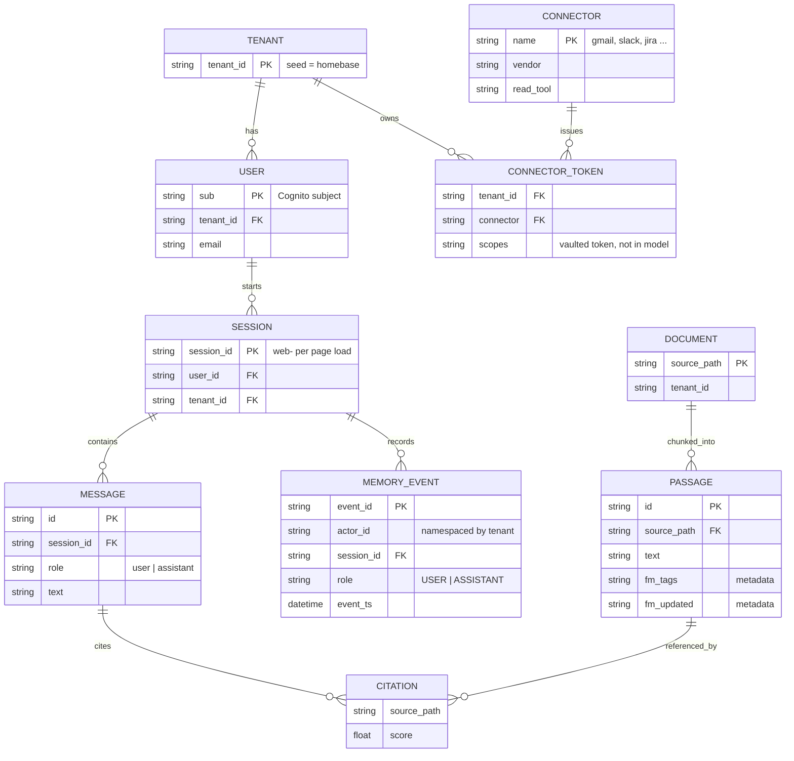
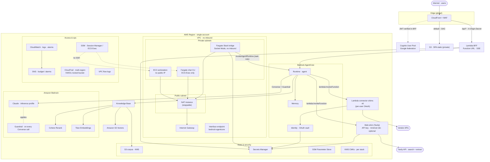
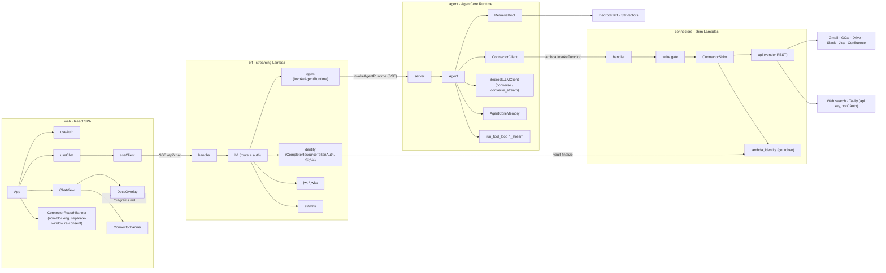
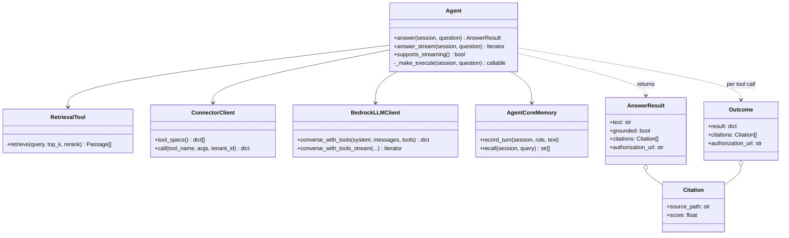
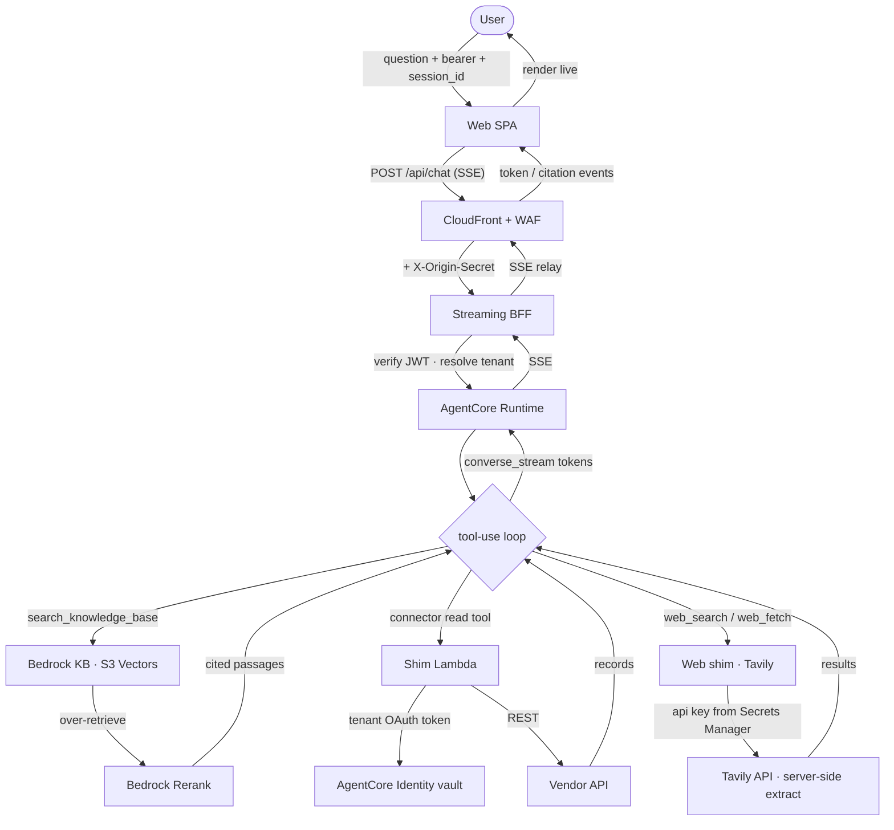
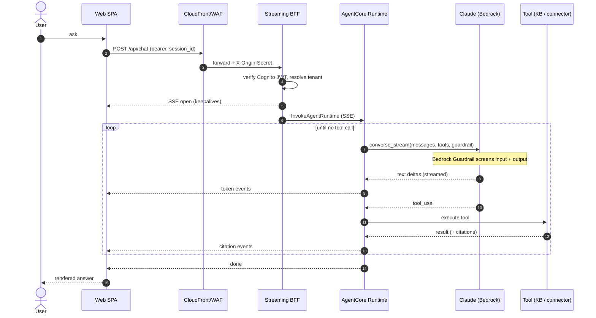
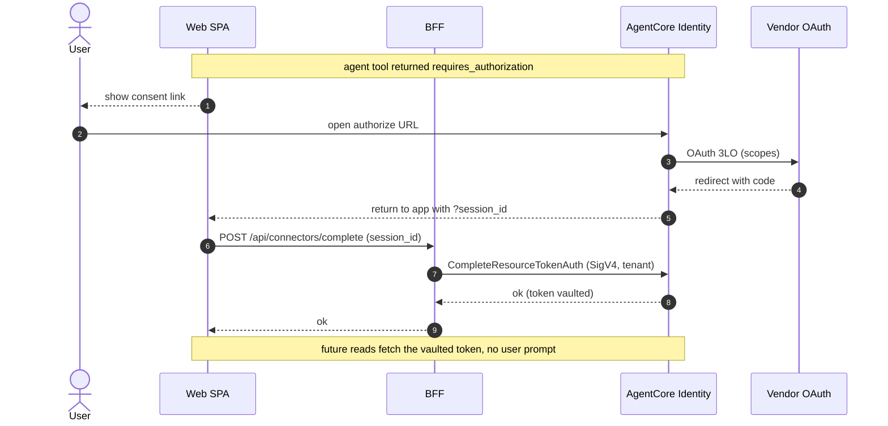
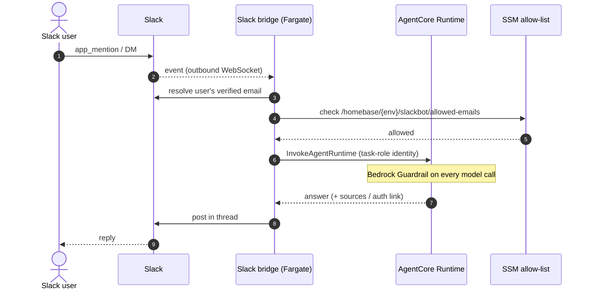
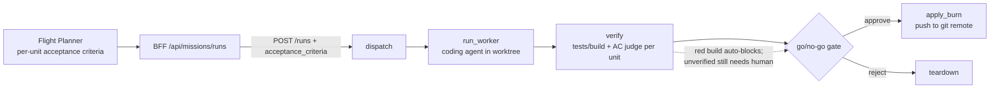
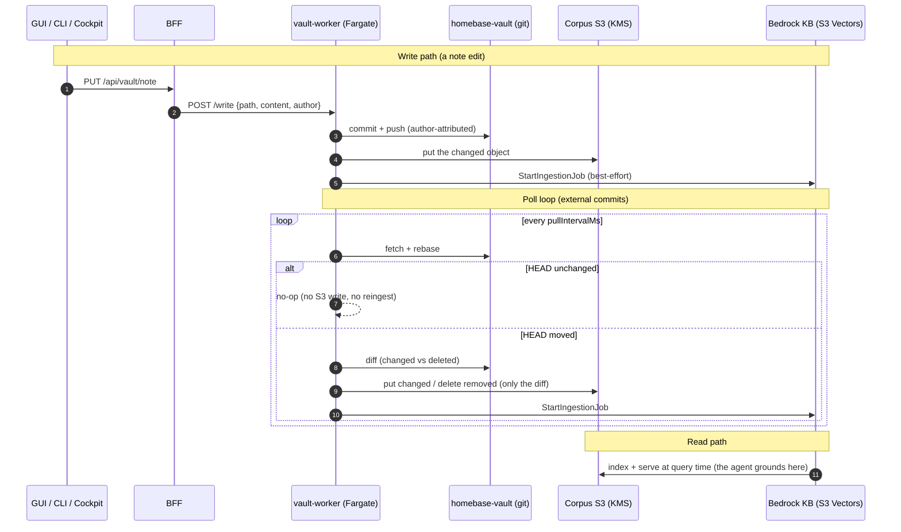

# Homebase diagrams

Canonical UML, ERD, data-flow, and sequence diagrams for Homebase. These render on
GitHub and in the app's **Docs** surface (rendered natively from this file). Keep
them in sync with the code; every identifier here is a placeholder.

---

## Data model (ERD)

Tenant and user identity are explicit on every record, so the single-tenant seed is
multi-tenant ready. Secrets (OAuth tokens, client credentials) are never modeled as
stored fields; they live in AWS Secrets Manager / the AgentCore Identity vault.

---

## AWS services and network topology

One region, one account. CloudFront (WAF + origin secret) is the only public ingress.
The BFF and shim Lambdas are not VPC-attached; the VPC carries the workstation, the
CLI, and an AgentCore interface endpoint, with private subnets that have no inbound
and egress only through a stoppable NAT.

---

## Components (UML component diagram)

The four deployables and their internal modules. Arrows are call/dependency
direction. The agent reaches connectors by invoking their shim Lambdas directly
(it holds the tenant, not a Cognito JWT); the Gateway also exposes them as MCP.

---

## Agent domain (UML class diagram)

The agent's core types. `answer` is the single-shot RAG path; `answer_stream`
drives the streaming tool loop when connectors are configured.

---

## Data flow (DFD)

One question, from keystroke to streamed answer. The tool loop chooses between
knowledge-base search and the live connectors; results feed back into Claude,
which streams the answer token by token.

---

## Sequence: streaming chat request

---

## Sequence: connector linking (3LO, self-service)

The first time a tenant uses a connector, the agent returns a consent link; after
the browser round-trip the GUI finalizes the session and the token is vaulted, so
every later read is headless.

---

## Sequence: Slack front door

Homebase is one brain behind multiple front doors (Vault, Chat, Plan, Mission, and
Slack). The Slack bridge runs Socket Mode (an outbound WebSocket, no inbound), resolves
the Slack user's verified email, gates on a by-hand allow-list, then invokes the same
agent runtime with that identity (the ssh-chat task-role pattern) and answers in a thread.

---

## Sequence: plan to execution (verify + gate)

A Flight Plan carries acceptance criteria per unit. The BFF maps each unit to a
Mission Control run and sends its criteria as `acceptance_criteria`. Mission Control's
state machine runs `dispatch -> run_worker -> verify -> gate -> apply_burn | teardown`:
the `verify` node runs the target repo's own tests/build plus a judged acceptance pass,
and can only ADD a block, never flip a no-go to a go. Builds land on a git remote (each
project's own target repo), not S3.

---

## Sequence: vault mirror (git to S3 to KB)

Git is the source of truth for the vault. The vault-worker owns the one clone: GUI,
CLI, and workstation-cockpit writes commit through it, and a poll loop picks up
external commits (for example a push from the cockpit). It mirrors to the corpus S3
bucket and triggers a Knowledge Base reingest ONLY when git actually moved, and then
only for the changed files, so an idle vault does no S3 writes. That is what keeps the
versioned corpus bucket from accumulating noncurrent-version churn.

