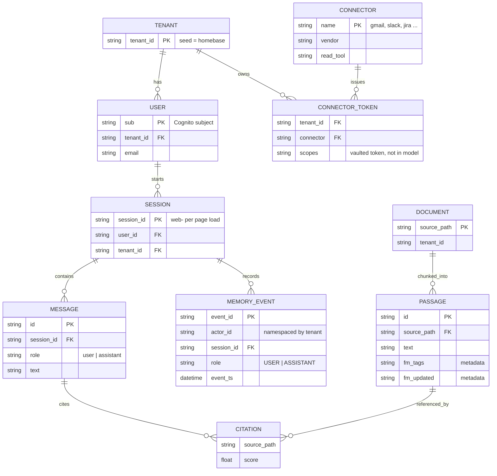
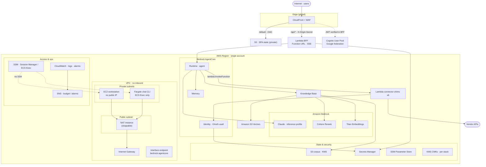
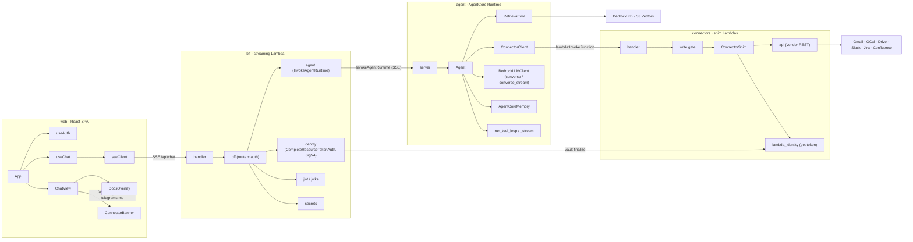
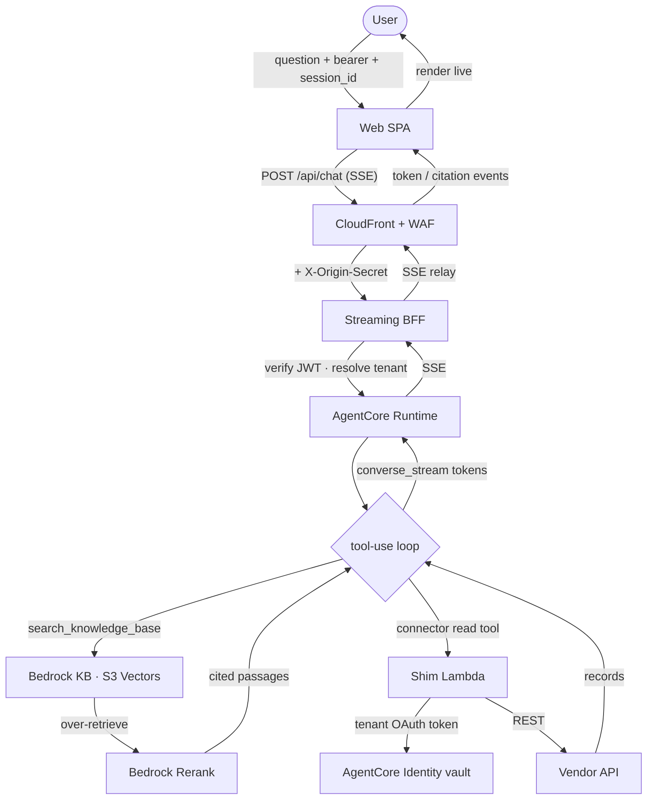
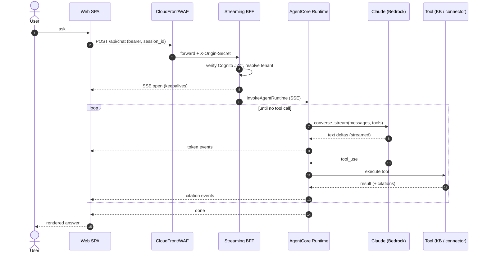
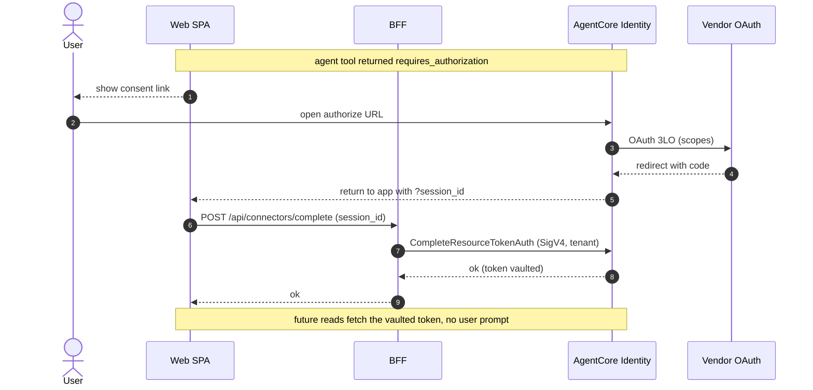

# Homebase diagrams

Canonical UML, ERD, data-flow, and sequence diagrams for Homebase. These render on
GitHub and are also surfaced in the app's **Docs → Diagrams** tab (parsed from this
file). Keep them in sync with the code; every identifier here is a placeholder.

---

## Data model (ERD)

Tenant and user identity are explicit on every record, so the single-tenant seed is
multi-tenant ready. Secrets (OAuth tokens, client credentials) are never modeled as
stored fields; they live in AWS Secrets Manager / the AgentCore Identity vault.

---

## AWS services and network topology

One region, one account. CloudFront (WAF + origin secret) is the only public ingress.
The BFF and shim Lambdas are not VPC-attached; the VPC carries the workstation, the
CLI, and an AgentCore interface endpoint, with private subnets that have no inbound
and egress only through a stoppable NAT.

---

## Components (UML component diagram)

The four deployables and their internal modules. Arrows are call/dependency
direction. The agent reaches connectors by invoking their shim Lambdas directly
(it holds the tenant, not a Cognito JWT); the Gateway also exposes them as MCP.

---

## Agent domain (UML class diagram)

The agent's core types. `answer` is the single-shot RAG path; `answer_stream`
drives the streaming tool loop when connectors are configured.

---

## Data flow (DFD)

One question, from keystroke to streamed answer. The tool loop chooses between
knowledge-base search and the live connectors; results feed back into Claude,
which streams the answer token by token.

---

## Sequence: streaming chat request

---

## Sequence: connector linking (3LO, self-service)

The first time a tenant uses a connector, the agent returns a consent link; after
the browser round-trip the GUI finalizes the session and the token is vaulted, so
every later read is headless.

