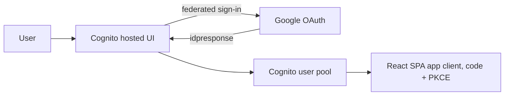

# Identity: Cognito and Google federation

Homebase authenticates users with an Amazon Cognito user pool. Users can sign in with a pool-local
account or federate through Google. This document covers the one setup step you do by hand, outside
the repository, before you apply the identity stack.

No real client id, client secret, hosted UI domain, or callback URL appears in this repository. All
of it lives in a git-ignored `terraform.tfvars` or in AWS Secrets Manager. The values below are
placeholders.

## Overview



## The by-hand step: create a Google OAuth client

This is the first "human does it outside the repo" moment. Do it before you apply the identity
stack. You never commit anything it produces.

1. In the Google Cloud Console, open APIs and Services, then Credentials.
2. Configure the OAuth consent screen if you have not already (external or internal as appropriate).
3. Create Credentials, choose OAuth client ID, and select application type Web application.
4. Add an authorized redirect URI that points at the Cognito hosted UI `idpresponse` endpoint:

   ```text
   https://<YOUR_HOSTED_UI_PREFIX>.auth.<YOUR_AWS_REGION>.amazoncognito.com/oauth2/idpresponse
   ```

   Replace `<YOUR_HOSTED_UI_PREFIX>` with the value you set for `hosted_ui_domain_prefix`, and
   `<YOUR_AWS_REGION>` with your region. These are placeholders; use your own values.
5. Save. Google gives you a client id and a client secret.

## Where the credentials go (never the repo)

- Client id: low sensitivity, but still kept out of a public repo. Put it in your git-ignored
  `infra/stacks/identity/terraform.tfvars` as `google_client_id`.
- Client secret: store it in AWS Secrets Manager, for example under the name
  `homebase/google-oauth-client-secret`. Terraform reads it by reference at apply time via
  `google_client_secret_source = "secrets_manager"` and `google_client_secret_name`.

  Create the secret once (example only; use your own values):

  ```bash
  aws secretsmanager create-secret \
    --name "homebase/google-oauth-client-secret" \
    --secret-string "<YOUR_GOOGLE_OAUTH_CLIENT_SECRET>"
  ```

  If Secrets Manager is not available, you may instead set
  `google_client_secret_source = "variable"` and put `google_client_secret` in the git-ignored
  tfvars. Prefer Secrets Manager.

## SPA redirect and sign-out URLs

The SPA app client uses the authorization code flow with PKCE and has no client secret. Set its
`callback_urls` and `logout_urls` in the git-ignored tfvars. Example placeholders:

```text
callback_urls = ["https://app.example.invalid/auth/callback"]
logout_urls   = ["https://app.example.invalid/"]
```

## After apply

The stack writes non-secret identifiers to SSM Parameter Store as `String`:

- `/homebase/<environment>/identity/user_pool_id`
- `/homebase/<environment>/identity/app_client_id`
- `/homebase/<environment>/identity/issuer_url`
- `/homebase/<environment>/identity/hosted_ui_domain`

The BFF and later stacks read these. Nothing secret is stored in SSM: the Google client secret stays
in Secrets Manager, and the SPA client has no secret at all.
