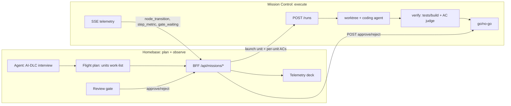

# Homebase to Mission Control seam

Homebase is the ground station: it plans (the AI-DLC interview, conducted by the
Homebase agent) and observes. Mission Control is the execution engine: it takes a
unit of work as a run, executes it with a coding agent in an isolated git worktree,
verifies it (the target repo's own tests/build plus a judged acceptance-criteria
pass), pauses at a go/no-go gate, applies and pushes on approval, and streams priced
telemetry. This document is the contract between them.

## Direction of the seam

Homebase drives Mission Control's `/runs` directly (one run per flight-plan unit).
Mission Control's own `/plans` planner is not used: planning moves to Homebase.

## Unit to run mapping

A flight plan is a reviewed spec whose work-list is a set of units (AI-DLC
INCEPTION and CONSTRUCTION items). Each unit becomes one Mission Control run.

| Flight-plan unit | Mission Control run (`POST /runs`) |
|---|---|
| `phase: INCEPTION` | `task_type: "sim"` (read-only investigation, never mutates) |
| `phase: CONSTRUCTION` | `task_type: "burn"` (side-effectful, pauses at the gate) |
| `plan.target` | `target` (the git repo the run works against) |
| unit title + plan objective/context + approved ACs + unit instruction | `prompt` (composed deterministically, see `buildPrompt`) |
| unit acceptance criteria (per-unit definition of done) | `acceptance_criteria` (judged by the verify node against that unit) |

The mapping lives in the BFF (`services/bff/src/mission.mjs`, `mapUnitToLaunch`),
because the BFF is the trusted server that holds the Mission Control token and calls
the engine. A `burn` run is gated by default; Homebase's review gate approves or
rejects it, honoring the flight-plan schema's "governed on commit" rule.

## Acceptance criteria and the verify node

Acceptance criteria are per-unit: each flight-plan unit (route waypoint) carries its
own definition of done, editable in the Flight Planner UI. The BFF sends them across
the seam on `POST /runs` as `acceptance_criteria`, so Mission Control judges each unit
against its own criteria, not a plan-wide list.

Mission Control's state machine runs `dispatch -> run_worker -> verify -> gate ->
apply_burn | teardown`. The `verify` node sits between `run_worker` and the go/no-go
gate and has two fail-closed axes:

1. **Deterministic checks.** Verify auto-detects the target repo's own test/build
   commands (pytest, npm, go, cargo, make, or a `.mission-control/verify.yml`
   override) and runs them in the worktree.
2. **Judged acceptance criteria.** An LLM judge scores the worktree against the unit's
   `acceptance_criteria` (advisory by default, enforcing when configured).

The gate honors the verdict: a red build auto-blocks without needing a human, an
unverified build still needs the human gate, and verification can only ADD a block,
never flip a no-go to a go. Builds go to a git remote (each project's own target
repo), never to S3.

## Endpoints

Homebase exposes these to the SPA (all behind the BFF's auth + tenant + origin
checks; present only when `HOMEBASE_MISSION_CONTROL_URL` is configured):

| Method | Path | Purpose |
|---|---|---|
| POST | `/api/missions/runs` | Launch a run. Body `{plan, unit}` (mapped) or a raw `{target, task_type, prompt}`. |
| GET | `/api/missions/runs` | List runs (`?status=&target=&limit=&offset=&order=`). |
| GET | `/api/missions/runs/{id}` | Run status + cost. |
| GET | `/api/missions/runs/{id}/changes` | Files changed (after apply). |
| POST | `/api/missions/runs/{id}/approve` \| `reject` \| `scrub` \| `cancel` | Drive the go/no-go gate. |
| GET | `/api/missions/runs/{id}/events` | SSE relay of the run's live telemetry. |
| GET | `/api/missions/metrics` | Cross-run cost/quality rollup for the deck. |

These map onto Mission Control's HTTP seam (`POST /runs`, `GET /runs`,
`GET /runs/{id}`, `GET /runs/{id}/changes`, `POST /runs/{id}/{decision}`,
`GET /runs/{id}/events`, `GET /metrics`).

## Auth

Mission Control reads are open; mutations require `Authorization: Bearer <token>`
when `MC_API_TOKEN` is set. Homebase presents a shared bearer token, read once from
Secrets Manager by ARN at cold start (like the vault worker's shared secret). The
service is reached over the private VPC (never public), the same posture as the
vault worker.

## Telemetry

The SSE feed emits `node_transition` (state machine), `step_metric` (priced
per-step: model, tokens, `cost_usd`, latency), and `gate_waiting` (a run paused for
go/no-go). The BFF relays these to the SPA as data-only frames with the event name
in `type`, matching the chat SSE client. `last_event_id` resumes after a drop.

## Open decisions (before the AWS deploy, Step 2)

These are captured in the build plan and are pending a human call:

1. **Worker compute + LLM path.** Where the coding-agent worker runs (Fargate task,
   the EC2 workstation, or AgentCore) and how it reaches Claude (Bedrock, aligned
   with the rest of Homebase, vs an Anthropic API key).
2. **CAPCOM's home.** Keep Mission Control's build coordinator (dependency-ordered
   dispatch, artifact verification, bounded retry) and hand it a finalized unit-list,
   or move orchestration into Homebase and drive `/runs` per unit directly.
3. **Target repos + git access.** What Mission Control builds against and how it gets
   credentials (a GitHub deploy token in Secrets Manager, like the vault worker).
4. **Auth on the seam.** Shared bearer secret (vault-worker pattern) vs Cognito JWT.
5. **Repo topology.** Mission Control stays its own repo (Homebase IaC deploys its
   container) vs vendored into Homebase.

## Status

Step 1 (this contract + the tested BFF client, feature-flagged off until the URL is
set) is implemented. Steps 2 to 4 (AWS deploy, moving the AI-DLC interview into the
Homebase agent, and the end-to-end plan-to-execution loop) follow.
