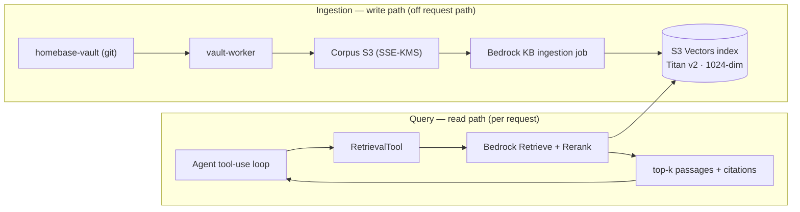
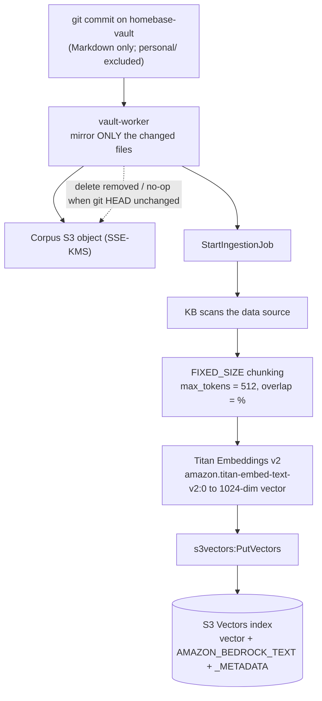
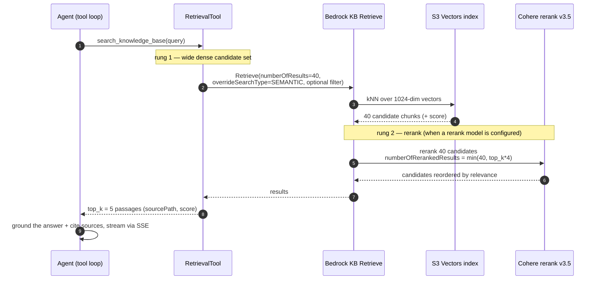
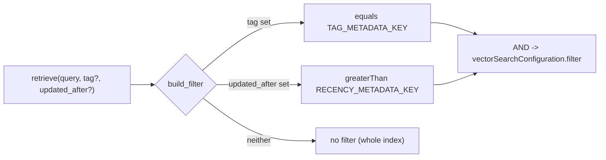
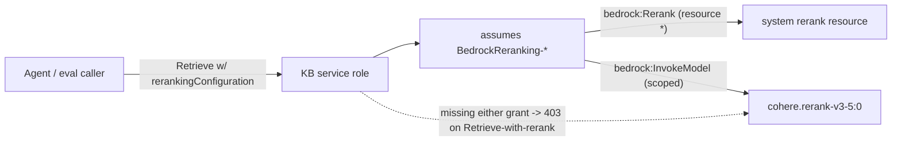
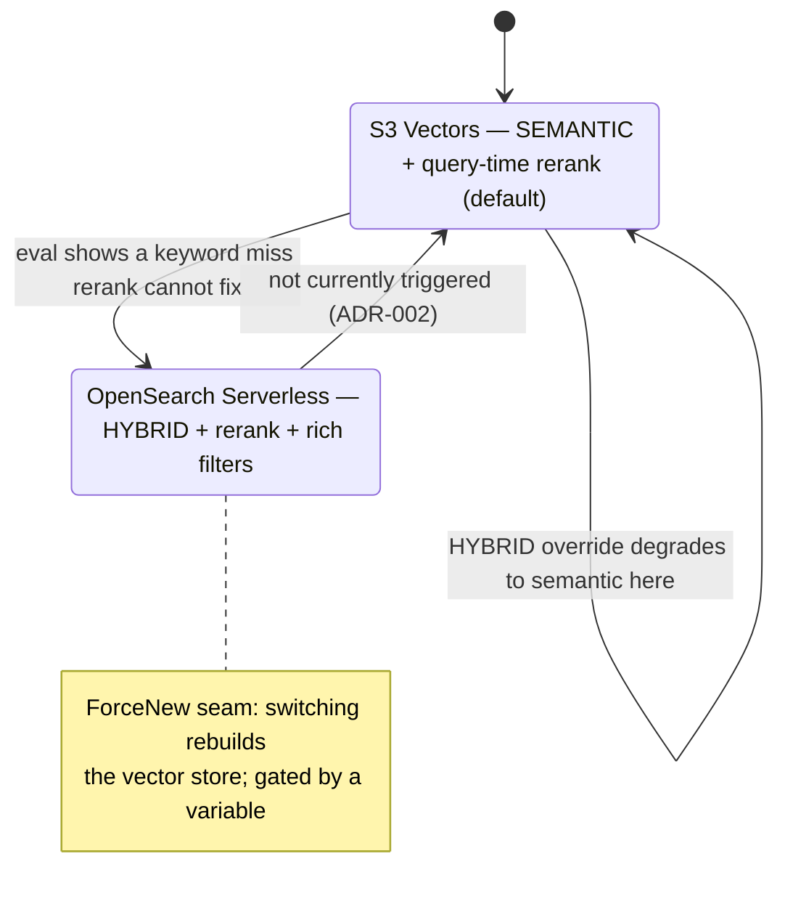
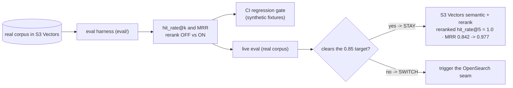

# RAG pipeline

How Homebase grounds answers in the vault: the **ingestion** path that turns
git-committed Markdown into a searchable vector index, and the **query** path that
retrieves, reranks, and cites passages for the agent. Every identifier is a
placeholder; the numbers are the current defaults in Terraform and code.

Ground truth: embeddings `amazon.titan-embed-text-v2:0` (1024-dim); vector store
Amazon S3 Vectors (semantic-only); chunking FIXED_SIZE, 512 tokens; rerank
`cohere.rerank-v3-5:0` at query time; over-retrieve 40, top-k 5. Sources:
`infra/stacks/retrieval`, `services/agent/src/homebase_agent/retrieval.py`,
`docs/retrieval.md` (ADR-002).

---

## 1. Two halves

Ingestion writes the index off the request path; query reads it. The S3 Vectors index
is the single shared artifact between them.

---

## 2. Ingestion: git to chunk to embed to index

A commit to the vault is mirrored (only the diff) to the corpus bucket, which triggers
a Knowledge Base ingestion job. The KB chunks each Markdown note, embeds each chunk,
and writes the vectors plus chunk text and metadata into the S3 Vectors index.
`personal/` is excluded everywhere, so private notes are never embedded.

---

## 3. Query time: two-rung retrieval (semantic over-retrieve, then rerank)

The agent's `search_knowledge_base` tool over-retrieves a wide semantic candidate set
from S3 Vectors, then reranks it with Cohere to pull the best passages to the top. S3
Vectors is semantic-only, so the search type is always `SEMANTIC`; rerank is a
query-time step, independent of the store.

Optional metadata narrowing (before rung 1): a `tag` filter and an `updated_after`
recency filter are ANDed into the vector search when supplied.

---

## 4. The rerank IAM boundary

Rerank runs under the **KB service role**, not the caller's role: Bedrock assumes a
`BedrockReranking-*` role to evaluate against a system rerank resource. The KB role
therefore needs both `bedrock:Rerank` (resource `*`, a system resource) and a scoped
`bedrock:InvokeModel` on the rerank model. Missing either turns Retrieve-with-rerank
into a 403 — and the ADR-002 eval fails with it.

---

## 5. ADR-002: the gated hybrid seam

S3 Vectors supports semantic search only; a `HYBRID` override silently degrades to
semantic on it. Hybrid (dense + keyword) is a marked, variable-gated seam to Amazon
OpenSearch Serverless, taken only if the evidence demands it. Because the S3 Vectors
storage arguments are ForceNew, switching rebuilds the store.

---

## 6. Evidence: the eval-driven decision loop

Whether semantic + rerank is good enough is decided on data, not opinion. The eval
harness scores hit rate and MRR with rerank off vs on; a CI regression gate guards the
retrieval code on synthetic fixtures, while a live eval on the real corpus decides the
ADR-002 question.

